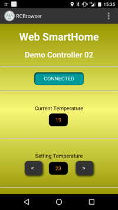

# BLE Components Specification

## Synopsis

`example01`

```html
<ble-service uuid="7F93D614-920A-48B0-8910-B3694E06E0FA">

  <ble-state
      default-text="NO CONNECTION"
      idle-text="NO CONNECTION"
      scanning-text="SEARCHING"
      connected-text="CONNECTED"
      error-text="ERROR" />

  <ble-setter uuid="06AFE76A-7859-4D78-B918-035AA960ED56" data="01" display="01" />
  <ble-setter uuid="06AFE76A-7859-4D78-B918-035AA960ED56" data="02" display="02" />
  <ble-setter uuid="06AFE76A-7859-4D78-B918-035AA960ED56" data="03" display="03" />
  <ble-setter uuid="06AFE76A-7859-4D78-B918-035AA960ED56" data="04" display="04" />
  <ble-setter uuid="06AFE76A-7859-4D78-B918-035AA960ED56" data="05" display="05" />
  <ble-setter uuid="06AFE76A-7859-4D78-B918-035AA960ED56" data="06" display="06" />
  <ble-setter uuid="06AFE76A-7859-4D78-B918-035AA960ED56" data="07" display="07" />
  <ble-setter uuid="06AFE76A-7859-4D78-B918-035AA960ED56" data="08" display="08" />
  <ble-setter uuid="06AFE76A-7859-4D78-B918-035AA960ED56" data="09" display="09" />
  <ble-setter uuid="06AFE76A-7859-4D78-B918-035AA960ED56" data="10" display="10" />
  <ble-setter uuid="06AFE76A-7859-4D78-B918-035AA960ED56" data="11" display="11" />
  <ble-setter uuid="06AFE76A-7859-4D78-B918-035AA960ED56" data="12" display="12" />

</ble-service>
```


`example02`

```html
<ble-service uuid="405E7866-A0CB-4006-B75B-2796687D8FBD">

  <ble-state
    default-text="NO CONNECTION"
    idle-text="NO CONNECTION"
    scanning-text="SEARCHING"
    connected-text="CONNECTED"
    error-text="ERROR" />

  <p>Current Temperature</p>
  <ble-observer uuid="573B455B-6E54-4BD4-B63A-8C5DF4713746" default="-">

  <p>Setting Temperature</p>
  <ble-setter uuid="5D0FEA1B-A2FC-4E41-9D85-FC76048C8CE1" data="0" display="&lt;" />
  <ble-observer uuid="02A7DBEE-7AE0-4CDB-A3CE-A2F3E6944C90" default="-" />
  <ble-setter uuid="5D0FEA1B-A2FC-4E41-9D85-FC76048C8CE1" data="1" display="&gt;" />

</ble-service>
```



## PREPARATION

Import the components with HTML Imports

```html
<link rel="import" href="ble-components.html">
```


### ble-service

If this tag found, when document become ready,
it starts to scan remote device which is defined with the UUID matches an attribute set here.

- uuid: Service UUID which remote device provides

```html
<ble-service uuid="7F93D614-920A-48B0-8910-B3694E06E0FA">
<!-- write other ble-component-tags for characteristic here -->
</ble-service>
```

### ble-state

You can show a message text for each state.
It changes automatically when state of BLE switches.

- default-text
- idle-text
- scanning-text
- connected-text
- error-text


```html
<ble-state
    default-text="NO CONNECTION"
    idle-text="NO CONNECTION"
    scanning-text="SEARCHING"
    connected-text="CONNECTED"
    error-text="ERROR" />
```
### ble-setter

This is a button element. When you tap this, it send a `data` value to
BLE service for characteristic which is set indicated UUID.

- uuid: UUID for a characteristic which you want to write to
- data: value you want to write to a characteristic when this button is tapped
- display: value whish is displayed on Web browser

```html
<ble-setter uuid="06AFE76A-7859-4D78-B918-035AA960ED56" data="12" display="12" />
```

### ble-observer

If this tag found in **ble-service**, it automatically starts to observe the value
for a characteristic with this UUID, and notifications comes, it displays latest value.

- uuid: UUID for a characteristic which you wanto to observe
- default: default value which is displayed on Web browser before first notification received

```html
<ble-observer uuid="02A7DBEE-7AE0-4CDB-A3CE-A2F3E6944C90" default="-" />
```
